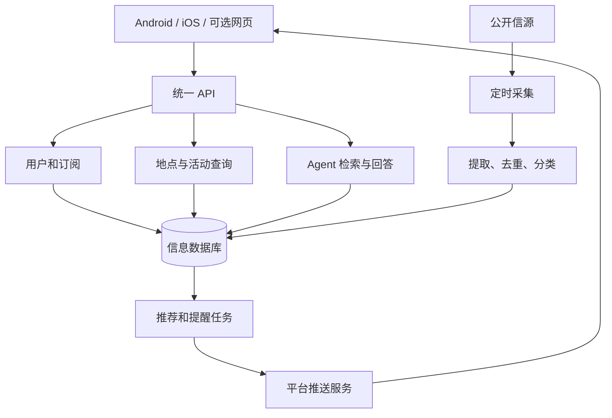

# 架构与接口协作

## 产品范围

2026 年 9 月 19 日首次会议确定方向：为北京大学学生获取、整合、筛选和推送校园及领域信息，并支持可溯源的主动查询。长期考虑开源自部署与云服务，课程阶段优先校园场景。APP 为当前讨论重点，网页和小程序是否同步交付仍待确认。

典型场景包括兴趣活动提醒、领域文章摘要与原文、地图上的地点活动查询，以及 Agent 基于信息库回答问题。不能把“某教室正在发生什么”的推断当成已核实事实，应展示时间、依据和不确定性。

## 推荐结构

## 模块边界

| 模块     | 输入与输出                 | 主要职责                                 |
| -------- | -------------------------- | ---------------------------------------- |
| 客户端   | API 数据 → 页面与用户操作 | 信息流、兴趣、地图、详情、查询与通知入口 |
| 用户订阅 | 身份与兴趣 → 持久化订阅   | 权限、偏好及通知设置                     |
| 采集     | 信源内容 → 标准信息       | 采集频率、来源、失败重试                 |
| 内容处理 | 原始信息 → 可检索记录     | 去重、分类、摘要、地点与时间提取         |
| 地图查询 | 地点和筛选条件 → 活动     | 地点关联、有效时间、详情链接             |
| 推荐     | 信息与订阅 → 候选提醒     | 匹配、去重、免打扰和可解释规则           |
| Agent    | 问题与检索资料 → 回答     | 使用证据、引用来源、说明未知             |
| 推送     | 待发提醒 → 平台送达记录   | 设备标识、重试、点击跳转                 |

采集、推荐和 Agent 的主要计算运行在服务器。不要依赖手机持续后台运行。推送可能被拒绝或延迟，APP 内保留消息中心。远程推送用于发现新信息，本地通知用于预先安排时间提醒。

## 数据设计起点

这些是概念实体，不是已批准的数据库表结构：用户、兴趣标签、订阅、信源、信息、活动、地点、设备、推送记录。信息保留原文链接、来源、发布时间、采集时间、处理时间；活动保留开始/结束时间、截止时间和地点。用户私有信息与公开信息明确区分，采集权限和内容使用条件逐项确认。

## 接口契约教程

以兴趣订阅为例：

1. 创建“确定订阅数据结构与接口契约”子 Issue。
2. 前后端一起确定请求字段、响应字段、鉴权、校验规则和错误状态。
3. 将契约提交到仓库，经 PR 评审；选择 OpenAPI 等机器可读格式时，同时保留易读说明。
4. 前端根据契约制作 Mock，后端并行实现，不等待对方完整结束。
5. 双方交付各自 PR，按照同一契约联调。
6. 如需改契约，先说明兼容性和影响，再同步调用方与测试。

接口文档至少包含方法与路径、身份要求、请求示例、响应示例、错误示例、分页和时间格式（适用时）。时间建议使用带时区的标准格式；页面展示时显式转换。

地图同样先决定坐标系、地点标识及活动关联，避免前后端和地图 SDK 使用不同坐标。复杂地点推断另设任务与验收条件。

## 未决事项

- 客户端框架和地图 SDK、平台兼容性。
- 登录方式、校内身份验证与私有信源接入范围。
- 首批公开信源、内容使用权限和更新频率。
- 推荐规则、LLM 服务、检索与成本控制。
- 首版是否包含系统推送，以及签名、厂商通道配置。

每项选型形成 Issue，输出比较、结论和验证证据，再更新本文与工程规范。
