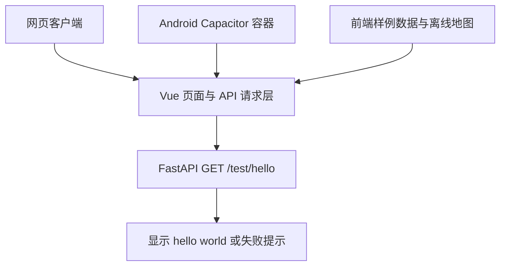
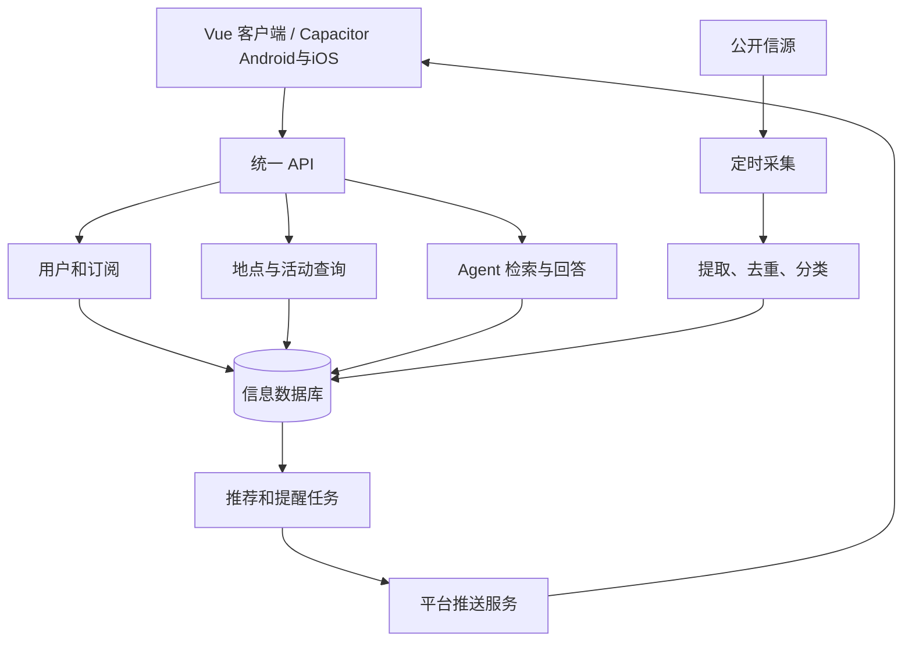

# 架构与接口协作

## 产品范围

2026 年 9 月 19 日首次会议确定方向：为北京大学学生获取、整合、筛选和推送校园及领域信息，并支持可溯源的主动查询。长期考虑开源自部署与云服务，课程阶段优先校园场景。最终交付目标为 Android/iOS APP，采用 Vue + Capacitor 共用前端；首阶段网页演示并验证最小 Android 包，iOS 后续，小程序不纳入当前范围。

典型场景包括兴趣活动提醒、领域文章摘要与原文、地图上的地点活动查询，以及 Agent 基于信息库回答问题。不能把“某教室正在发生什么”的推断当成已核实事实，应展示时间、依据和不确定性。

## 首阶段结构与数据边界

客户端网页已在 frontend/ 实现，包含离线地图与样例页面；hello 测试区已接入请求。backend/ 已实现 FastAPI hello 服务；整体联调及另一名成员复现仍需按验收清单完成。技术栈见 [工程规范](engineering.md#技术栈与实施阶段)。



地图、日历、详情、兴趣、账户与 Agent 使用前端样例数据；仅 hello 调用真实后端。不引入活动接口、登录、数据库或模型服务。界面状态不等于用户数据已经保存，原型附件只在本地预览，Agent 文案不是模型实际回答。

沿用 design 的地图快照和米制坐标转换，以地图原点 `[116.304, 39.9915]`、x 向东、z 向南组织原型显示。迁移保留同一几何工具与数据来源，不混用在线 SDK 坐标。二维和三维共用校园数据、建筑选择及活动样例；示意楼层、室内布局、活动时间和示例定位不表示真实测绘、占用或实时位置。后续接入设备定位或在线底图时，另行确认坐标转换契约。

资源迁移保留 OSM 来源、数据快照和许可证；公众分发需有可见的 OSM 署名及许可入口。Three.js、字体和图片同样保留适用许可证，不能因目录迁移丢失。

## 首阶段接口契约

后端已实现此本地演示接口。

| 项目 | 约定 |
| --- | --- |
| 方法与路径 | `GET /test/hello` |
| 身份要求 | 无需登录，仅用于演示连通性 |
| 请求 | 无请求体，无必需查询参数 |
| 成功状态 | HTTP 200 |
| 响应类型 | `application/json` |
| 响应字段 | `message`：字符串，值为 `hello world` |

“无需登录”指 hello 不需要业务账号。公网测试入口另有网关访问 key，浏览器输入一次后用 Cookie 访问；网关剥离测试凭证，并保留未来业务 `Authorization` 与业务 Cookie，二者职责独立。部署配置与访问方式见 [部署说明](deployment.md#4-设置测试访问认证并启动)。管理后台尚未实现；若后续采用 `/admin/` 独立网页，管理 API 仍须由后端逐请求校验账号及权限，不能把测试 key 当成管理员身份。

成功响应示例：

```json
{"message":"hello world"}
```

前端请求期间显示加载状态；收到 HTTP 200 且响应字段符合约定后显示 message。网络失败、非 200 状态或响应格式不符时显示可理解的失败提示并允许重试，不把前端样例 hello 当成请求成功。不为本接口增加业务错误码或统一业务响应包裹；后续业务接口的错误结构另行约定。

后端本地地址为 `http://127.0.0.1:8000`。网页开发与构建预览允许从本机 localhost 或 127.0.0.1 的 5173、8765 和 8766 端口跨域访问；Android/Capacitor 来源与手机局域网访问尚未配置。
网页通过开发代理或受控跨域配置访问后端；APP 通过可配置 API 地址直连手机可访问的开发服务。原生容器的请求来源与浏览器可能不同，联调配置需分别核对。当前客户端使用 `VITE_API_BASE_URL` 配置基地址；开发/构建预览端口分别为 8765/8766，未配置开发代理。后端需按实际网页 Origin 配置 CORS，安装与联调步骤见 [工程规范](engineering.md#目录与启动命令)。

## 后续目标架构

以下模块与数据库是持久化、采集、推荐和 Agent 阶段的目标，不属于首阶段已经实现的能力。



后端采用模块化单体，共用 API 和 PostgreSQL；SQLAlchemy 负责数据访问，Alembic 管理表结构迁移。采集和推荐后续通过独立 Python worker 运行，复用业务服务与数据库访问，不在请求内执行长时间任务。数据库表及业务接口在对应任务中确认，本次不预设完整 schema。

## 模块边界

| 模块     | 输入与输出                 | 主要职责                                 |
| -------- | -------------------------- | ---------------------------------------- |
| 客户端   | API 数据 → 页面与用户操作 | 信息流、兴趣、地图、详情、查询与通知入口 |
| 用户订阅 | 身份与兴趣 → 持久化订阅   | 权限、偏好及通知设置                     |
| 采集     | 信源内容 → 标准信息       | 采集频率、来源、失败重试                 |
| 内容处理 | 原始信息 → 可检索记录     | 去重、分类、摘要、地点与时间提取         |
| 地图查询 | 地点和筛选条件 → 活动     | 地点关联、有效时间、详情链接             |
| 推荐     | 信息与订阅 → 候选提醒     | 匹配、去重、免打扰和可解释规则           |
| Agent    | 问题与检索资料 → 回答     | 使用证据、引用来源、说明未知             |
| 推送     | 待发提醒 → 平台送达记录   | 设备标识、重试、点击跳转                 |

采集、推荐和 Agent 的主要计算运行在服务器。不要依赖手机持续后台运行。推送可能被拒绝或延迟，APP 内保留消息中心。远程推送用于发现新信息，本地通知用于预先安排时间提醒。

## 数据设计起点

这些是概念实体，不是已批准的数据库表结构：用户、兴趣标签、订阅、信源、信息、活动、地点、设备、推送记录。信息保留原文链接、来源、发布时间、采集时间、处理时间；活动保留开始/结束时间、截止时间和地点。用户私有信息与公开信息明确区分，采集权限和内容使用条件逐项确认。

## 接口契约教程

以兴趣订阅为例：

1. 创建“确定订阅数据结构与接口契约”子 Issue。
2. 前后端一起确定请求字段、响应字段、鉴权、校验规则和错误状态。
3. 将契约提交到仓库，经 PR 评审；选择 OpenAPI 等机器可读格式时，同时保留易读说明。
4. 前端根据契约制作 Mock，后端并行实现，不等待对方完整结束。
5. 双方交付各自 PR，按照同一契约联调。
6. 如需改契约，先说明兼容性和影响，再同步调用方与测试。

接口文档至少包含方法与路径、身份要求、请求示例、响应示例、错误示例、分页和时间格式（适用时）。时间建议使用带时区的标准格式；页面展示时显式转换。

地图同样先决定坐标系、地点标识及活动关联，避免前后端和地图 SDK 使用不同坐标。复杂地点推断另设任务与验收条件。

## 未决事项

- Capacitor 地图性能及 Android/iOS 平台兼容性；真实定位、在线底图或导航如需引入，单独确认 SDK 与坐标转换。
- 登录方式、校内身份验证与私有信源接入范围。
- 首批公开信源、内容使用权限和更新频率。
- 推荐规则、LLM 服务、中文检索质量与成本控制；pgvector、Redis + Celery 是否需要。
- 后续系统推送供应商、签名与国内 Android 厂商通道；iOS 构建和真机分发条件。首阶段不包含系统推送。

每项选型形成 Issue，输出比较、结论和验证证据，再更新本文与工程规范。

## 后端测试部署边界

#29 使用课程机上的独立 Python 虚拟环境/进程运行后端，公网 Nginx 经 loopback SSH 隧道转发。环境与前端绑定由公网机 SQLite 管理，控制接口仅通过受限 SSH JSON RPC 调用，不进入业务 FastAPI。

#27 网页同样由公网 Nginx 分发静态文件，不运行额外前端进程。浏览器先读取当前入口的 runtime-config.json，再请求同源 API；build_id 及真实后端响应 SHA 防止版本混淆。main/分支/PR 路由是部署别名，前端构建和后端实例分别按版本保存；网页当前与回滚记录独立持有后端引用。具体配置字段、安全边界及受限控制接口见 [网页预览契约](deployment.md#网页预览实现与维护)。

普通前端默认连接 main 共享测试后端；跨 PR 联调解析为固定 SHA 实例。后端 PR 的最新入口与不可变版本入口分开，main、打开的后端 PR 与前端绑定分别记录保留依据。引用与浏览器在线人数无关。路径前缀由网关去除，GET /test/hello 契约不变。具体端口、生命周期、返回字段与 #27 接入方式见 [部署教程](deployment.md)。
