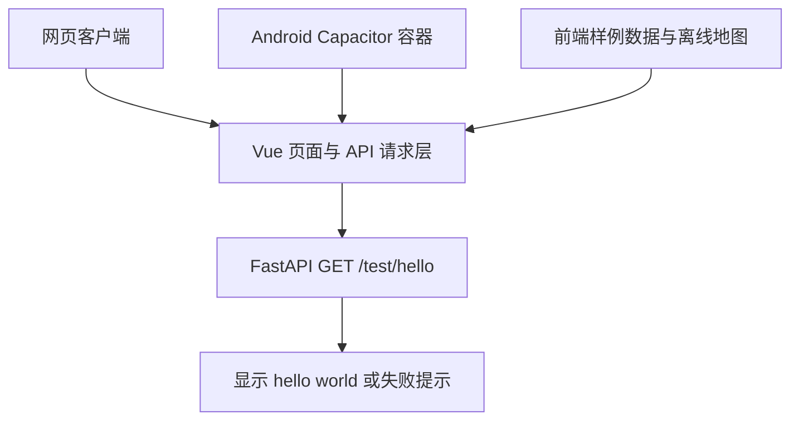
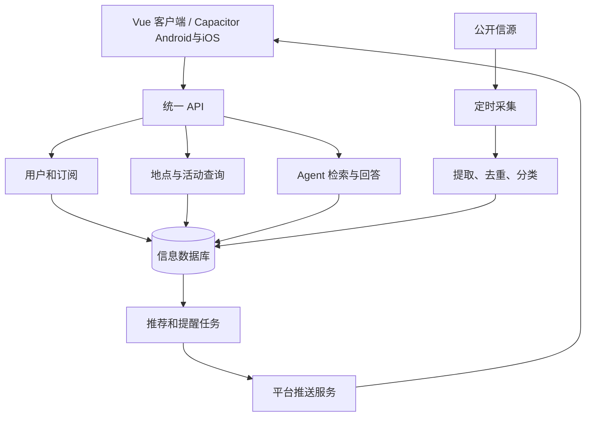

# 系统架构

## 产品范围

2026 年 9 月 19 日首次会议确定方向：为北京大学学生获取、整合、筛选和推送校园及领域信息，并支持可溯源的主动查询。长期考虑开源自部署与云服务，课程阶段优先校园场景。最终交付目标为 Android/iOS APP，采用 Vue + Capacitor 共用前端；首阶段网页演示并验证最小 Android 包，iOS 后续，小程序不纳入当前范围。

典型场景包括兴趣活动提醒、领域文章摘要与原文、地图上的地点活动查询，以及 Agent 基于信息库回答问题。不能把“某教室正在发生什么”的推断当成已核实事实，应展示时间、依据和不确定性。

## 技术栈与实施阶段

技术路线由 [Issue #19](https://github.com/TomoriKaho/Livelife/issues/19) 确认。前后端运行方法分别见[前端 README](../frontend/README.md)和[后端 README](../backend/README.md)。

| 层次 | 确定方案 | 实施阶段与用途 |
| --- | --- | --- |
| 客户端 | Vue 3 + TypeScript + Vite + Vue Router | 首阶段网页与移动布局；npm 管理依赖并提交 package-lock.json |
| 地图 | Canvas 2D + Three.js | 首阶段复用离线校园地图；2D 作为低性能设备的可选入口 |
| APP | Capacitor | 同一前端支持 Android/iOS；首阶段最小 Android 包，iOS 后续 |
| API | Python + FastAPI + Pydantic | 已实现本地 hello 接口及响应校验；业务接口后续引入 |
| 数据库 | PostgreSQL + SQLAlchemy + Alembic | 业务持久化阶段引入；首阶段不启动数据库 |
| 后台任务 | 独立 Python worker | 后续采集与推荐；不依赖手机后台运行 |
| 部署 | Python venv + Supervisor；Nginx + SSH 隧道 | 课程机普通用户直接运行后端，公网机提供 HTTPS；#29 实施 |

检索先基于真实中文校园内容验证分词与召回；pgvector、Redis + Celery、LLM 服务、登录及推送供应商待专项确认。当前采用组件状态和模块化单体，地图使用离线快照。

### 客户端选择依据

最终目标为 APP，网页是开发和演示入口。design 原型采用标准 Vue 页面、Vue Router、DOM/SVG 手绘效果、Canvas 2D 和 Three.js。Vue + Capacitor 可继续沿用 Web 实现，再通过原生插件接入系统能力；uni-app 和 Flutter 不作为本次实施路线，小程序需求如进入范围需另行评估。

Capacitor 页面在原生容器的 WebView 中运行，复用代码不代表已经验证原生体验。地图性能、键盘、安全区、返回键、定位和通知必须在对应设备验证。国内 Android 厂商推送通道另行调研，不能把生成安装包当成推送已经可用。

参考：[Capacitor 介绍](https://capacitorjs.com/docs)、[构建流程](https://capacitorjs.com/docs/basics/workflow)、[FastAPI 特性](https://fastapi.tiangolo.com/features/)。

## 首阶段结构与数据边界

客户端网页已在 frontend/ 实现，包含离线地图与样例页面；hello 测试区已接入请求。backend/ 提供 FastAPI hello 服务。网页及真机验收方法见[测试说明](testing.md)。

地图、日历、详情、兴趣、账户与 Agent 使用前端样例数据；仅 hello 调用真实后端。不引入活动接口、登录、数据库或模型服务。界面状态不等于用户数据已经保存，原型附件只在本地预览，Agent 文案不是模型实际回答。

沿用 design 的地图快照和米制坐标转换，以地图原点 `[116.304, 39.9915]`、x 向东、z 向南组织原型显示。迁移保留同一几何工具与数据来源，不混用在线 SDK 坐标。二维和三维共用校园数据、建筑选择及活动样例；示意楼层、室内布局、活动时间和示例定位不表示真实测绘、占用或实时位置。后续接入设备定位或在线底图时，另行确认坐标转换契约。

资源迁移保留 OSM 来源、数据快照和许可证；公众分发需有可见的 OSM 署名及许可入口。Three.js、字体和图片同样保留适用许可证，不能因目录迁移丢失。

## 接口协作

请求、响应和客户端失败处理统一见 [API 契约](api.md)。前后端按同一契约开发，变更时同步调用方与测试。

## 后续目标架构

以下模块与数据库是持久化、采集、推荐和 Agent 阶段的目标，不属于首阶段已经实现的能力。

后端采用模块化单体，共用 API 和 PostgreSQL；SQLAlchemy 负责数据访问，Alembic 管理表结构迁移。采集和推荐后续通过独立 Python worker 运行，复用业务服务与数据库访问，不在请求内执行长时间任务。数据库表及业务接口在对应任务中确认，完整 schema 随业务契约确定。

## 模块边界

| 模块     | 输入与输出                 | 主要职责                                 |
| -------- | -------------------------- | ---------------------------------------- |
| 客户端   | API 数据 → 页面与用户操作 | 信息流、兴趣、地图、详情、查询与通知入口 |
| 用户订阅 | 身份与兴趣 → 持久化订阅   | 权限、偏好及通知设置                     |
| 采集     | 信源内容 → 标准信息       | 采集频率、来源、失败重试                 |
| 内容处理 | 原始信息 → 可检索记录     | 去重、分类、摘要、地点与时间提取         |
| 地图查询 | 地点和筛选条件 → 活动     | 地点关联、有效时间、详情链接             |
| 推荐     | 信息与订阅 → 候选提醒     | 匹配、去重、免打扰和可解释规则           |
| Agent    | 问题与检索资料 → 回答     | 使用证据、引用来源、说明未知             |
| 推送     | 待发提醒 → 平台送达记录   | 设备标识、重试、点击跳转                 |

采集、推荐和 Agent 的主要计算运行在服务器。不要依赖手机持续后台运行。推送可能被拒绝或延迟，APP 内保留消息中心。远程推送用于发现新信息，本地通知用于预先安排时间提醒。

## 数据设计起点

这些是概念实体，不是已批准的数据库表结构：用户、兴趣标签、订阅、信源、信息、活动、地点、设备、推送记录。信息保留原文链接、来源、发布时间、采集时间、处理时间；活动保留开始/结束时间、截止时间和地点。用户私有信息与公开信息明确区分，采集权限和内容使用条件逐项确认。

## 未决事项

- Capacitor 地图性能及 Android/iOS 平台兼容性；真实定位、在线底图或导航如需引入，单独确认 SDK 与坐标转换。
- 登录方式、校内身份验证与私有信源接入范围。
- 首批公开信源、内容使用权限和更新频率。
- 推荐规则、LLM 服务、中文检索质量与成本控制；pgvector、Redis + Celery 是否需要。
- 后续系统推送供应商、签名与国内 Android 厂商通道；iOS 构建和真机分发条件。首阶段不包含系统推送。

每项选型形成 Issue，输出比较、结论和验证证据，再更新本文及相关模块文档。

## 后端测试部署边界

#29 使用课程机上的独立 Python 虚拟环境/进程运行后端，公网 Nginx 经 loopback SSH 隧道转发。环境与前端绑定由公网机 SQLite 管理，控制接口仅通过受限 SSH JSON RPC 调用，不进入业务 FastAPI。

#27 网页同样由公网 Nginx 分发静态文件，不运行额外前端进程。浏览器先读取当前入口的 runtime-config.json，再请求同源 API；build_id 及真实后端响应 SHA 防止版本混淆。main/分支/PR 路由是部署别名，前端构建和后端实例分别按版本保存；网页当前与回滚记录独立持有后端引用。具体配置字段、安全边界及受限控制接口见 [网页预览契约](deployment.md#网页预览实现与维护)。

普通前端默认连接 main 共享测试后端；跨 PR 联调解析为固定 SHA 实例。后端 PR 的最新入口与不可变版本入口分开，main、打开的后端 PR 与前端绑定分别记录保留依据。引用与浏览器在线人数无关。路径前缀由网关去除，GET /test/hello 契约不变。具体端口、生命周期、返回字段与 #27 接入方式见 [部署教程](deployment.md)。

## 课程机构建控制边界

课程机统一拉取指定 SHA、检查、测试与构建，公网机仅管理引用、网关和静态分发；GitHub Runner 不执行分支代码、不传输产物大包。普通无凭证请求工作流通过 workflow_run 进入 main 的受信控制程序。课程机全项目并发最多 2，构建通过命名空间隔离访问范围；后端复用已测试 venv，网页包由公网机通过 SSH 直接读取。固定 SHA 和 main/PR/网页回滚引用规则不变。新调度是否已上线、镜像配置与 RPC 字段见[统一构建契约](deployment.md#课程机统一构建与队列)。

## Android 测试包边界

Android 复用客户端页面，通过包内原生配置选择公开 HTTPS 后端，并读取安装包状态。配置失败或包过期时停用接口测试，样例页面仍可查看；安装包的后端引用独立于网页。字段和校验约定见[部署说明](deployment.md#原生配置契约)，成员操作见[Android 教程](testing.md#android-测试包操作)。
